# Introduction

## Examples

Wish to analyze data in which response is a &ldquo;direction&rdquo;:

-   2d directional data are called *circular* data
-   3d directional data are called *spherical* data
-   not all &ldquo;directional&rdquo; data are directions in the usual sense
-   &ldquo;directional&rdquo; data may also arise in higher dimensions

## Wind Directions

-   Recorded at  Col de la Roa, Italian Alps
-   n = 310 (first 40 listed below)
-   Radians, clockwise from north
-   Source: Agostinelli (CSDA 2007); also R package `circular`

-   Data

    <table border="2" cellspacing="0" cellpadding="6" rules="groups" frame="hsides">
    
    
    <colgroup>
    <col  class="org-right" />
    
    <col  class="org-right" />
    
    <col  class="org-right" />
    
    <col  class="org-right" />
    
    <col  class="org-right" />
    </colgroup>
    <tbody>
    <tr>
    <td>6.23</td>
    <td>1.03</td>
    <td>0.15</td>
    <td>0.72</td>
    <td>2.20</td>
    </tr>
    
    
    <tr>
    <td>0.46</td>
    <td>0.63</td>
    <td>1.45</td>
    <td>0.37</td>
    <td>1.95</td>
    </tr>
    
    
    <tr>
    <td>0.08</td>
    <td>0.15</td>
    <td>0.33</td>
    <td>0.09</td>
    <td>0.09</td>
    </tr>
    
    
    <tr>
    <td>6.23</td>
    <td>0.05</td>
    <td>6.14</td>
    <td>6.28</td>
    <td>6.17</td>
    </tr>
    
    
    <tr>
    <td>6.24</td>
    <td>6.02</td>
    <td>6.14</td>
    <td>6.25</td>
    <td>0.01</td>
    </tr>
    
    
    <tr>
    <td>5.38</td>
    <td>5.30</td>
    <td>5.63</td>
    <td>0.77</td>
    <td>1.34</td>
    </tr>
    
    
    <tr>
    <td>6.14</td>
    <td>0.22</td>
    <td>6.23</td>
    <td>2.33</td>
    <td>3.61</td>
    </tr>
    
    
    <tr>
    <td>0.49</td>
    <td>6.12</td>
    <td>0.01</td>
    <td>0.00</td>
    <td>0.46</td>
    </tr>
    </tbody>
    </table>

-   Plot

    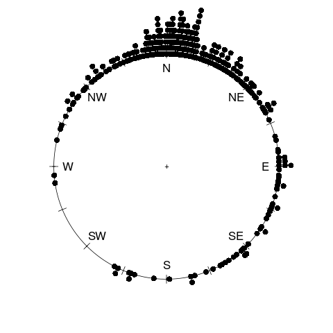

## Arrival Times at an ICU

-   24-hour clock times (format `hrs.mins`)
-   n = 254 (first 32 listed below)
-   Source: Cox & Lewis (1966); also Fisher (1993) and R package
    `circular`

-   Data

    <table border="2" cellspacing="0" cellpadding="6" rules="groups" frame="hsides">
    
    
    <colgroup>
    <col  class="org-right" />
    
    <col  class="org-right" />
    
    <col  class="org-right" />
    
    <col  class="org-right" />
    </colgroup>
    <tbody>
    <tr>
    <td>11.00</td>
    <td>17.00</td>
    <td>23.15</td>
    <td>10.00</td>
    </tr>
    
    
    <tr>
    <td>12.00</td>
    <td>8.45</td>
    <td>16.00</td>
    <td>10.00</td>
    </tr>
    
    
    <tr>
    <td>15.30</td>
    <td>20.20</td>
    <td>4.00</td>
    <td>12.00</td>
    </tr>
    
    
    <tr>
    <td>2.20</td>
    <td>12.00</td>
    <td>5.30</td>
    <td>7.30</td>
    </tr>
    
    
    <tr>
    <td>12.00</td>
    <td>16.00</td>
    <td>16.00</td>
    <td>1.30</td>
    </tr>
    
    
    <tr>
    <td>11.05</td>
    <td>16.00</td>
    <td>19.00</td>
    <td>17.45</td>
    </tr>
    
    
    <tr>
    <td>20.20</td>
    <td>21.00</td>
    <td>12.00</td>
    <td>12.00</td>
    </tr>
    
    
    <tr>
    <td>18.00</td>
    <td>22.00</td>
    <td>22.00</td>
    <td>22.05</td>
    </tr>
    </tbody>
    </table>

-   Plot

    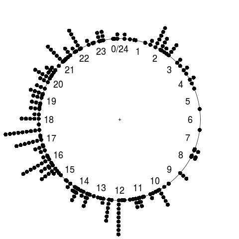

## Primate Vertebrae

-   Orientation of left superior facet of last lumbar vertebra in
    humans, gorillas, and chimpanzees
-   Source: Keifer (2005 UF Anthropology MA Thesis)

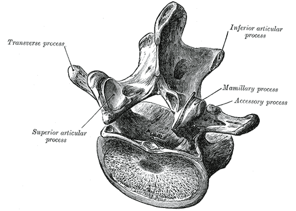

## Plot of Human Data

, 16 gorillas (green) and 19 humans (blue).")

## Butterfly Migrations

-   Direction of travel observed for 2649 migrating butterflies in
    Florida
-   Source: Thomas J Walker, University of Florida, Dept of Entomology
    and Nematology
-   Other variables:
    -   site: 23 locations in Florida
    -   observer: Thomas Walker (tw) or James J. Whitesell (jw)
    -   species: cloudless sulphur (cs), gulf fritillary (gf),
        long-tailed skipper (lt)
    -   distance to coast (km)
    -   date and time of observation
    -   percentage of sky free of clouds
    -   quality of sunlight: (b)right, (h)aze, (o)bstructed, (p)artly
        obstructed
    -   presence/absence and direction (N, NE, E, SE, S, SW, W, NW) of wind
    -   temperature

## Why is the Analysis of Directional Data Different?

-   First three observations from the wind directions data:
    `6.23, 1.03, 0.15`
-   The mean of these three numbers is
    `2.47`
-   What do you think?

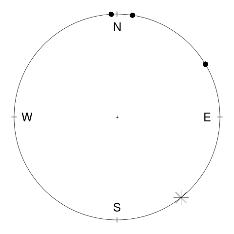

# Graphical Display of Directional Data

## Graphical Display of Circular Data (in R)

-   Have already seen simple dot plots for circular data, e.g., for
    the wind data:

    windc <- circular(wind, type="angles", units="radians",
                      template="geographics")
    require("circular")
    par(mar=c(0,0,0,0)+0.1, oma=c(0,0,0,0)+0.1)
    plot(windc, cex=1.5, axes=FALSE,
         bin=360, stack=TRUE, sep=0.035, shrink=1.3)
    axis.circular(at=circular(seq(0, (7/4)*pi, pi/4),
                      template="geographics"),
                  labels=c("N","NE","E","SE","S","SW","W","NW"),
                  cex=1.4)
    ticks.circular(circular(seq(0, (15/8)*pi, pi/8)),
                   zero=pi/2, rotation="clock",
                   tcl=0.075)

## Graphical Display of Circular Data (in R) (ctd)

-   and for the ICU data:

    ## Note that pch=17 does not work properly here.
    par(mar=c(0,0,0,0)+0.1, oma=c(0,0,0,0)+0.1)
    plot(fisherB1c, cex=1.5, axes=TRUE,
         bin=360, stack=TRUE, sep=0.035, shrink=1.3)

-   and one more &#x2026;

## Graphical Display of Circular Data (in R) (ctd)

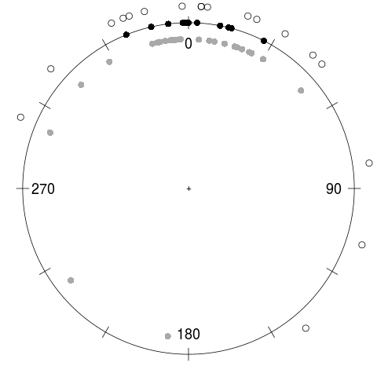

## Graphical Display of Circular Data (in R) (ctd)

    par(mar=c(0,0,0,0)+0.1, oma=c(0,0,0,0)+0.1)
    plot(fisherB10c$set1, units="degrees", zero=pi/2,
         rotation="clock", pch=16, cex=1.5)
    ticks.circular(circular(seq(0, (11/6)*pi, pi/6)),
                   zero=pi/2, rotation="clock", tcl=0.075)
    points(fisherB10c$set2, zero=pi/2,
           rotation="clock", pch=16, col="darkgrey",
           next.points=-0.1, cex=1.5)
    points(fisherB10c$set3, zero=pi/2,
           rotation="clock", pch=1,
           next.points=0.1, cex=1.5)

## Circular Histograms

-   [Circular histograms](https://www.google.com/search?q=R+circular+histogram) exist (see Fisher and Mardia and Jupp) but is
    there a ready-made function in R?

## Rose Diagrams

-   Invented by [Florence Nightingale](https://en.wikipedia.org/wiki/Florence_Nightingale) (elected first female member of
    the Royals Statistical Society in 1859; honorary member of ASA)
-   [Nightingale's rose in R](https://github.com/jennybc/r-graph-catalog/tree/master/figures/fig05-14_nightingale-data) (see also [this post](http://www.r-bloggers.com/going-beyond-florence-nightingales-data-diagram-did-flo-blow-it-with-wedges/) and the [R graph catalog](http://shiny.stat.ubc.ca/r-graph-catalog/))
-   Note that radii of segments are proportional to *square root* of
    the frequencies (counts), so that areas are proportional to
    frequencies.  Is this the right thing to do?
-   Rose diagrams suffer from the same problems as histograms.  The
    impression conveyed may depend strongly on:
    -   the binwidth of the cells
    -   the choice of starting point for the bins

## Adding a Rose Diagram to the Plot of Wind Directions

    rose.diag(windc, bins=16, col="darkgrey",
              cex=1.5, prop=1.35, add=TRUE)

## Adding a Rose Diagram to the Plot of Wind Directions

.")

## Changing the Binwidth

-   Fewer/Wider Bins

    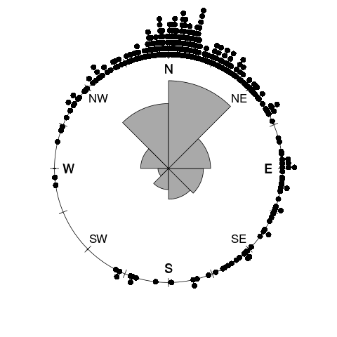

-   Narrow Bins

    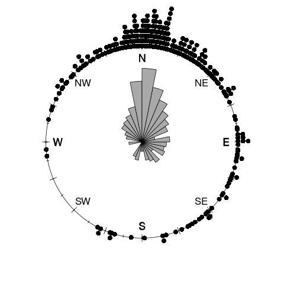

## Changing the Radii

-   I think that the default &ldquo;radii proportional to counts&rdquo; is
    generally best, but this is not always obvious.  The scale
    certainly makes a big difference however.

    rose.diag(windc, bins=16, col="darkgrey",
              radii.scale="linear",
              cex=1.5, prop=2.4, add=TRUE)

## Changing the Radii

.")

## Kernel Density Estimates

    lines(density.circular(windc, bw=40), lwd=2, lty=1)

## Kernel Density Estimates

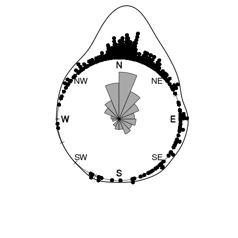

## Spherical Data

-   Are there any canned routines for plotting spherical data in R?

# Basic Summary Statistics

## Mean Direction and Mean Resultant Length

-   First three observations from the wind directions data:

<table border="2" cellspacing="0" cellpadding="6" rules="groups" frame="hsides">

<colgroup>
<col  class="org-right" />

<col  class="org-right" />

<col  class="org-right" />
</colgroup>
<tbody>
<tr>
<td>theta</td>
<td>x</td>
<td>y</td>
</tr>

<tr>
<td>6.23</td>
<td>-0.06</td>
<td>1.00</td>
</tr>

<tr>
<td>1.03</td>
<td>0.86</td>
<td>0.51</td>
</tr>

<tr>
<td>0.15</td>
<td>0.15</td>
<td>0.99</td>
</tr>
</tbody>
</table>

-   resultant (sum of direction vectors):
    (`0.952`,
    `2.5`)

-   mean vector: \((\bar{x}, \bar{y}) = \)
    (`0.317`,
    `0.833`)

-   resultant length (Euclidean norm of resultant): R = 
    `2.675`

-   mean resultant length: \(\bar{R} = \)
       `0.892`

-   mean direction: \((\bar{x}, \bar{y})/\bar{R} = \)
    (`0.356`,
    `0.934`)

-   \(\tilde{\theta} = \)
       `0.364`

## Plot

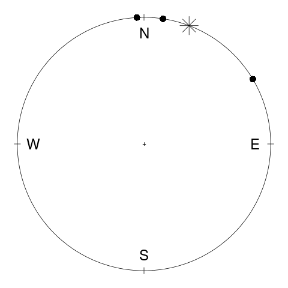

# Aside: Generating from the Uniform Distribution on the Sphere

## Generating Random Points on the Sphere

-   Wish to generate a random &ldquo;direction&rdquo; in d-dimensions; i.e., an
    observation from the uniform distribution in the \(d-1\) sphere.
-   Usual way: let X &sim; Nd(0, I) and return U = X/||X||.
-   An alternative rejection sampler:
    -   Repeat until ||X|| <= 1
        -   Let X be uniformly distributed on the cube [-1,1]d
    -   Return U = X/||X||
-   What is the acceptance rate for the rejection sampler:
    -   Volume of the \(d - 1\) sphere is \(\pi^{d/2}/\Gamma(d/2 + 1)\)
    -   Volume of [-1,1]d is 2d
    -   Acceptance rate is \((\pi^{1/2}/2)^d/\Gamma(d/2 + 1)\)
    -   Curse of dimensionality

<table border="2" cellspacing="0" cellpadding="6" rules="groups" frame="hsides">

<colgroup>
<col  class="org-left" />

<col  class="org-right" />

<col  class="org-right" />

<col  class="org-right" />

<col  class="org-right" />

<col  class="org-right" />

<col  class="org-right" />

<col  class="org-right" />

<col  class="org-right" />

<col  class="org-right" />
</colgroup>
<tbody>
<tr>
<td>dimension</td>
<td>2</td>
<td>3</td>
<td>4</td>
<td>5</td>
<td>6</td>
<td>7</td>
<td>8</td>
<td>9</td>
<td>10</td>
</tr>

<tr>
<td>accept rate (%)</td>
<td>79</td>
<td>52</td>
<td>31</td>
<td>16</td>
<td>8</td>
<td>4</td>
<td>2</td>
<td>1</td>
<td>0</td>
</tr>
</tbody>
</table>

## Code for Timing Results

    runifSphere <- function(n, dimension, method=c("norm", "cube", "slownorm")) {
        method <- match.arg(method)
        if (method=="norm") {
            u <- matrix(rnorm(n*dimension), ncol=dimension)
            u <- sweep(u, 1, sqrt(apply(u*u, 1, sum)), "/")
        } else if (method=="slownorm") {
            u <- matrix(nrow=n, ncol=dimension)
            for (i in 1:n) {
                x <- rnorm(dimension)
                xnorm <- sqrt(sum(x^2))
                u[i,] <- x/xnorm
            }
        } else {
            u <- matrix(nrow=n, ncol=dimension)
            for (i in 1:n) {
                x <- runif(dimension, -1, 1)
                xnorm <- sqrt(sum(x^2))
                while (xnorm > 1) {
                    x <- runif(dimension, -1, 1)
                    xnorm <- sqrt(sum(x^2))
                }
                u[i,] <- x/xnorm
            }
        }
        u
    }

## Easy fix for Borel&rsquo;s paradox in 3-d

Take longitude \(\phi \sim U(0,2\pi)\) independent of latitude \(\theta = \arcsin(2U-1)\), \(U \sim U(0,1)\).

# Rotationally Symmetric Distributions

## Comparison of Projected Normal and Langevin Distributions

One way that we might compare the \(\nlangevin(\mu, \kappa)\) and
\(\npn(\gamma\mu, I)\) distributions by choosing &kappa; and &gamma; to
give the same mean resultant lengths and comparing the densities of
the cosine of the angle &theta; between \(U\) and \(\mu\).

Of course matching mean resultant lengths is not necessarily the best
way to compare these families of distributions.

## \(d = 2\)

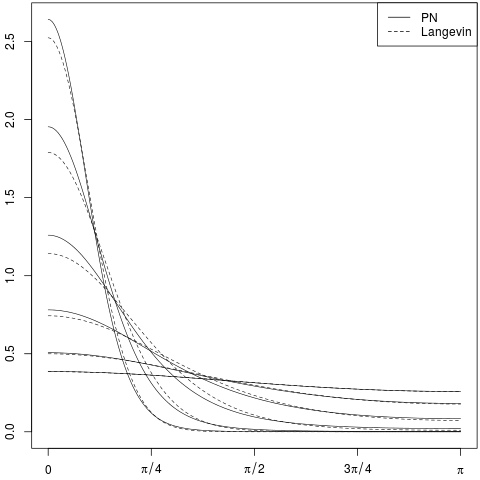

## \(d = 3\)

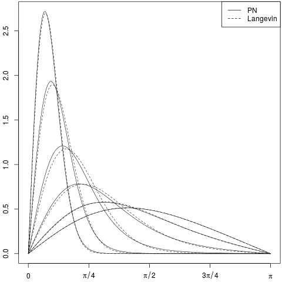

## \(d = 4\)

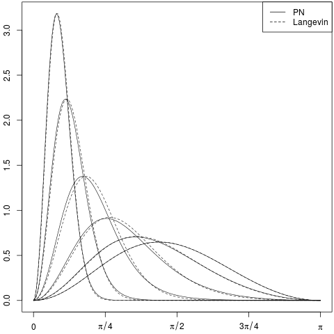
